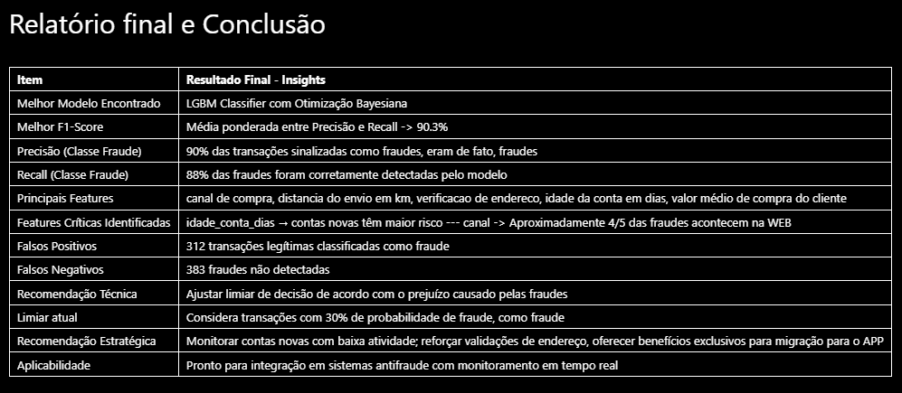

# 🛡️ Projeto: Radar de Fraudes

**O Radar de Fraudes é um sistema inteligente para detecção precisa de transações fraudulentas em e-commerce.
Ele combina ciência de dados e aprendizado de máquina para identificar padrões suspeitos com alta acurácia.**

## 🎯 Objetivo
Detectar transações fraudulentas em e-commerce com máxima precisão, utilizando técnicas avançadas de ciência de dados e aprendizado de máquina.
## **⚙️ Abordagens Utilizadas**
- Engenharia de atributos: extração de variáveis relevantes para modelagem.
- Otimização Bayesiana: ajuste eficiente de hiperparâmetros.
- Modelagem preditiva:  uso de algoritmos robustos para classificação em cenários com dados desbalanceados.
- Explicabilidade de modelos (XAI): interpretação dos resultados para garantir transparência e confiança.
- Aplicação em Streamlit: aplicação interativa para visualização dos resultados e testes em tempo real.

📈 Resultados Esperados
- 💸 Redução de perdas financeiras causadas por fraudes.
- 🔒 Aumento da confiabilidade nas transações online.
- 🧠 Suporte à tomada de decisão com insights claros e interpretáveis.

# Resultados obtidos:

# Aplicação em Streamlit: 

🧾 Funcionalidades da Aplicação
- Modelo Funcional pronto para teste através aplicação interativa.
- Dashboard interativo em Streamlit com visualizações financeiras e operacionais do modelo.
- Gráficos de ROI (Waterfall) para justificar o investimento no projeto.
- Radar de métricas de desempenho com KPIs como precisão, recall, F1-score e taxas de erro.
- Visualização da proporção de fraudes detectadas vs não detectadas, facilitando a análise de risco residual.
- Painel de explicabilidade por transação, destacando os fatores que influenciaram a decisão do modelo.
+ **Endereço da aplicação:** [Acesse aqui](http://54.152.72.80:8502)

